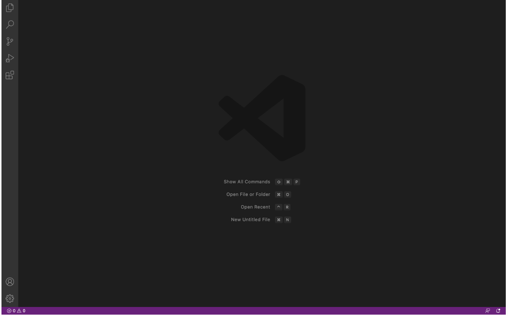
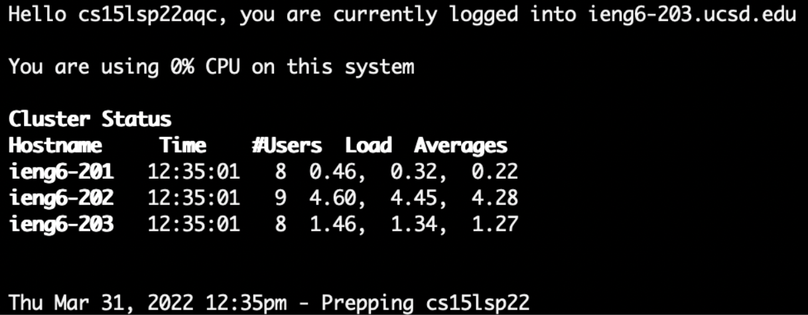
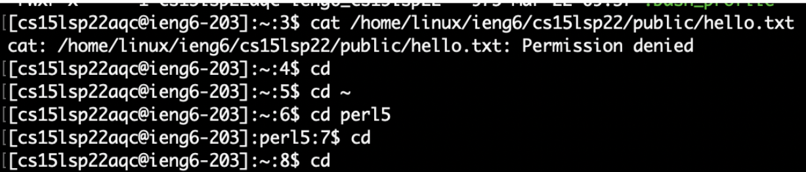
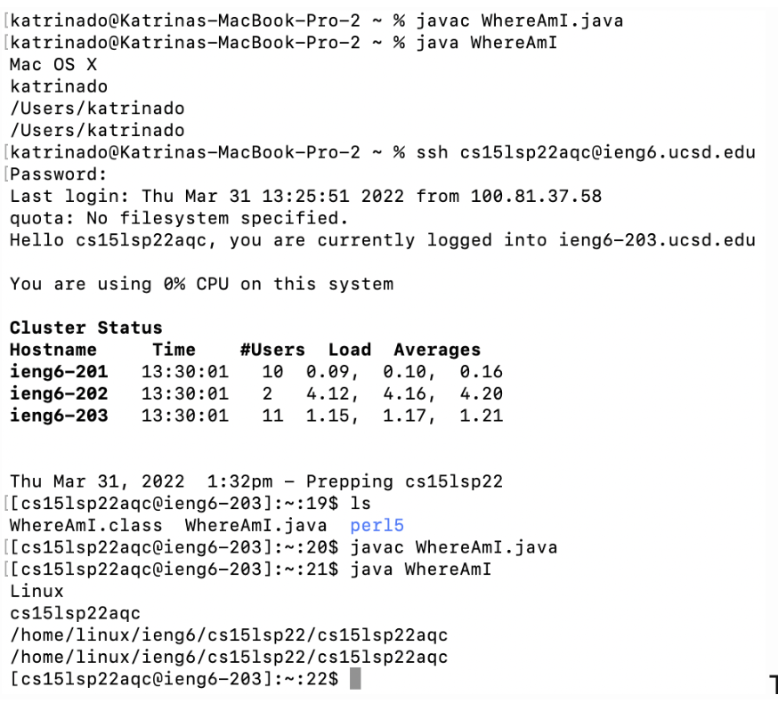
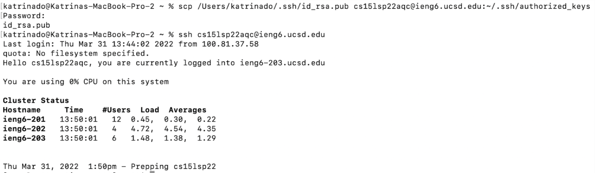
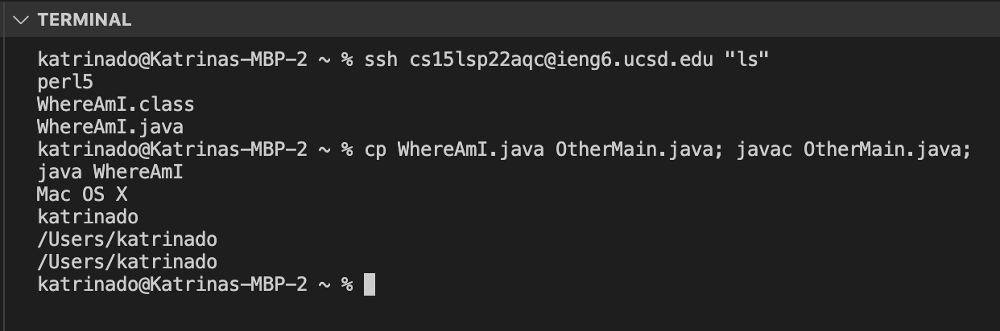

# Lab Report 1, Week 2

## 1. Installing VScode


The first thing one should do when accessing their course specific account on ieng is having a code editor downloaded onto their computer. Installing [VsCode](https://code.visualstudio.com/) will give you access to an editor.

---

## 2. Remotely Connecting


In order to remotely connect to your course specific account, you must first find your course specific user [here](
https://sdacs.ucsd.edu/~icc/index.php). The user must also install [OpenSSH](https://docs.microsoft.com/en-us/windows-server/administration/openssh/openssh_install_firstuse) if they are using Windows. The user will then open a terminal in VsCode and type the following command. Using their specific account.

```
$ ssh cs15lsp22zz@ieng6.ucsd.edu
```

---

## 3. Trying Some Commands


The user should then test a few commands to see if the remote computer is working correctly. For my example I tested the *cat* command as well as the *cd* command. The *cat* command displayed the message "Permission denied" because there currently is no content in the file. The *cd* command allows the user to change directory and in my example I changed it to the per15 directory.

---

## 4. Moving Files with `scp`


The files from the local computer are then moved to the remote computer with the *scp* command. For my example I created the file *WhereAmI.java* on my local computer then used the following command. As well as the *ls* command to see that it successfully moved to the remote computer.

```
scp WhereAmI.java cs15lsp22zz@ieng6.ucsd.edu:~/
```

---

## 5. Setting an SSH Key


Then I set the SSH key on my local device by using `$ ssh-keygen`. While setting the passphrase for the save key I just returned nothing so that it doesn't ask me for a password when I'm trying to access my remote computer, saving lots of time (about 5 minutes).

---

## 6. Optimizing Remote Running


After everything is set up I test some command shorthands to save time, such as `$ ssh cs15lsp22zz@ieng6.ucsd.edu "ls"` and `$ cp WhereAmI.java OtherMain.java; javac OtherMain.java;
java WhereAmI` . The first automatically runs the *ls* command and the second runs multiple commands with the use of ";" separating them.
